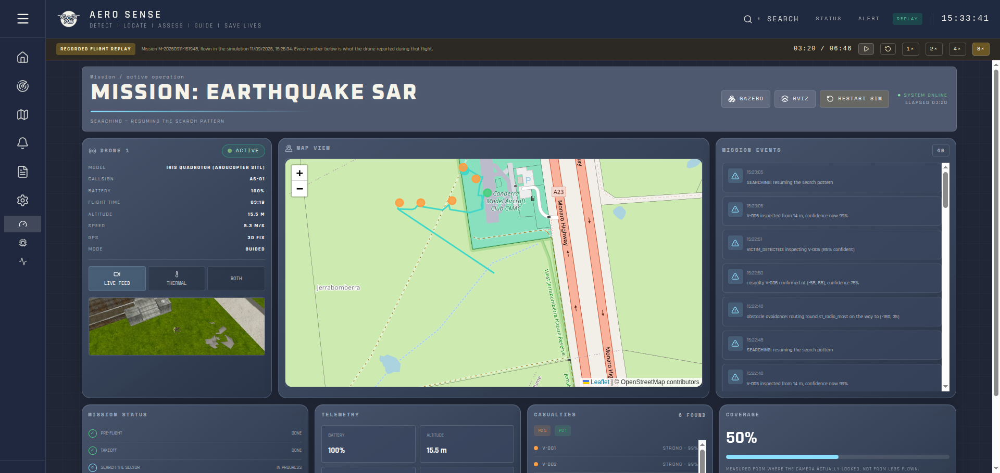
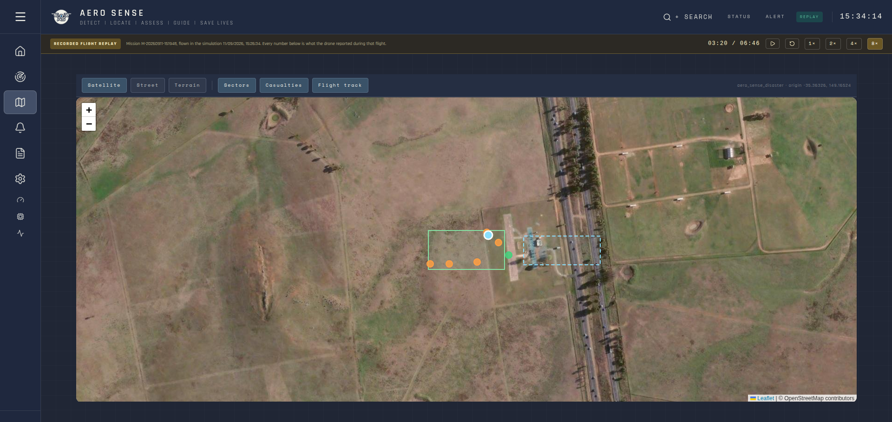
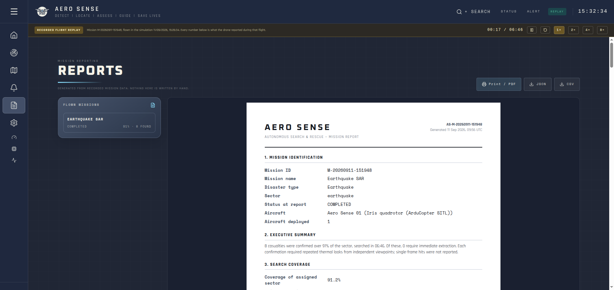
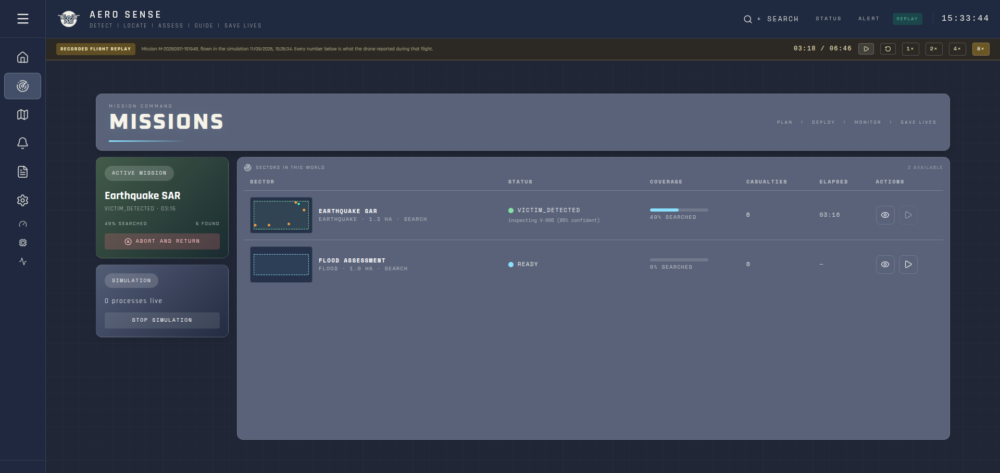
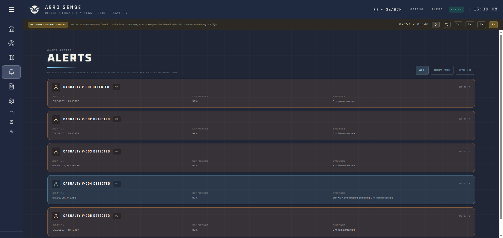
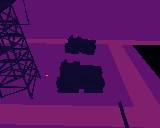
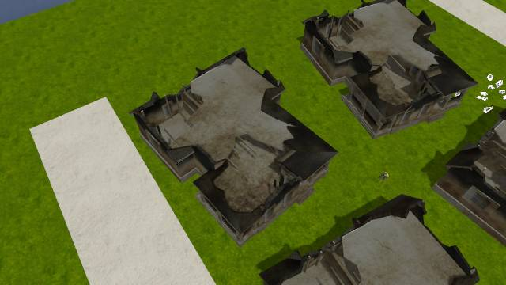
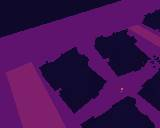

# Aero Sense — search-and-rescue drone simulation

An autonomous search-and-rescue drone for Smart India Hackathon 2026. It flies a Gazebo disaster
zone (earthquake + flood sectors) under ArduPilot SITL, finds casualties with thermal perception,
triages them, routes around obstacles, and reports everything to a live command-centre dashboard.

**Website: https://kushsaraf.github.io/AeroSense_SIH26/** — the dashboard playing back a real
recorded flight of the earthquake sector (track, thermal and RGB camera, confirmed casualties with
triage, obstacle-avoidance events, printable report). The simulation itself cannot run on a web
host, so every page says it is a replay; run `tools/dashboard.sh` to fly one live.

Tests, flight results, the triage scorecard and screenshots: [docs/VERIFICATION.md](docs/VERIFICATION.md).

## What's where

```
sih_2026/
├── src/              ROS 2 packages — the drone system (one folder per package, below)
├── frontend/         React dashboard (live, or replay on the website) — see frontend/README.md
├── tools/            launch scripts and helper tools (start here to run anything)
├── hardware/         real parts: manufacturer CAD, parts list, what is still needed
├── docs/             ARCHITECTURE.md (design), VERIFICATION.md (test + flight results), images/
├── legacy/prototype/ the first single-process version, superseded by src/ — kept for reference
├── .github/          GitHub Pages workflow that publishes the replay website
└── reference/        third-party Gazebo model repos (not in git; see "Reference assets")
```

Generated, gitignored: `build/`, `install/`, `log/` (colcon), `logs/` (run logs).

### ROS 2 packages (`src/`)

| Package | What it does |
|---|---|
| `aero_sense_interfaces` | custom messages and services (victims, alerts, mission status, …) |
| `aero_sense_bringup` | launch files (`full_system`, `simulation`, `visualization`), `system_check`, `stop_sim` |
| `aero_sense_description` | the bespoke Hexa-X hexacopter + sensor payload, rendered from `config/sensors.yaml` |
| `aero_sense_gazebo` | the disaster world: an Indian residential society split into earthquake and flood sectors, command base, signs and zone names, search areas outlined in yellow |
| `aero_sense_mission` | mission manager, autopilot adapter (MAVLink), search pattern, airspace |
| `aero_sense_perception` | thermal victim detection, tracking, geolocation, triage, structure map |
| `aero_sense_navigation` | obstacle field for detours around structures |
| `aero_sense_scenario_manager` | casualty placement (`config/victims.yaml`) and ground truth |
| `aero_sense_visualization` | RViz config and markers |
| `aero_sense_bridge` | HTTP bridge from ROS to the dashboard (:8000), process supervisor |

### The drone

A bespoke **Hexa-X hexacopter** (not a commercial airframe), built only from ArduPilot's own
Gazebo parts: `ArduPilotPlugin`, the iris rotor's blade aerodynamics and prop mesh, and ArduCopter's
Hexa-X motor mixer (`FRAME_CLASS 2`, `FRAME_TYPE 1`). Everything is generated from one table,
`src/aero_sense_description/config/sensors.yaml`:

- `airframe:` arm length, body size and mass, inertia, max motor speed, the battery slung under
  the body, and the landing gear. Replace these with the real components' figures.
- `mount:` and the sensor sections: the payload (RGB, depth, LWIR thermal, IMU, barometer), each with the real part's field of view.
  Sensors sit on their own `payload_link`, separate from the flight model, so adding one does not
  touch how the drone flies.

The frame is the team's own design, meshed from its CAD (arms, motor mounts and skid landing
gear), and the cameras are the real ones from their manufacturers' CAD: a Luxonis OAK-D Pro W and
a FLIR Lepton 3.5, pointing straight down from a tray hung under the strapped 6S 10000 mAh battery.
The Pixhawk 6C Mini and Qualcomm RB5 sit in the bay between the plates and an ESC under each arm,
as labelled boxes at their published sizes, wired up. [hardware/README.md](hardware/README.md) lists every part, what
is still to be chosen, and how to turn a new STEP file into a mesh (`tools/step_to_mesh.py`).
The motor order lives in `render.py` (`HEXA_X`); tests check it against ArduPilot's mixer.

### The world

The earthquake and flood sectors are one Indian residential society, and nothing in it is on a grid
or straight. Winding asphalt roads and narrow concrete galis run through dense pastel RCC row
houses, shops and G+3 apartment blocks with black Sintex tanks on their roofs, all facing the
street. In the earthquake sector many buildings are pancaked or slumped with rubble and dust
spilling into the lanes, and electric poles lean. The flood sector's village stands in water that
stops at a ragged, muddy shoreline. `tools/make_buildings.py` makes the buildings,
`tools/layout_world.py` lays everything out around the casualties, and both can be re-run.

### Casualties

`src/aero_sense_scenario_manager/config/victims.yaml` lists 22 casualties, each built from its entry
(`victim_models.py`):

- **Visibility:** `full` in the open; `partial` with legs under a rubble heap, or only the `feet`
  showing, or only a `hand` (out of a rubble mound, or above flood water with the body under it);
  `buried` under a mound, where a living casualty leaves only a faint warm patch on the surface.
- **Alive or dead:** the deceased read near ambient temperature and never move; some of the living
  move (`waving` arm, `crawling` body), driven by the `victim_motion` node.
- **Priority** follows stated rules (tested): trapped and alive first (P1), the deceased last (P3).

Ground truth (`/aero_sense/ground_truth/victims`) carries all of this for evaluation, and
`tools/record_thermal_dataset.py` saves labelled thermal and RGB frames for building detection,
vital-sign and triage algorithms. Perception never reads either.

### Tools (`tools/`)

| Script | Use |
|---|---|
| `dashboard.sh` | start everything: bridge + frontend + simulation (`--stop` to stop) |
| `demo.sh` | simulation + RViz + a scored search, no dashboard |
| `search_evaluation.py` | fly a search and score it against ground truth |
| `record_replay.py` | record the running flight into `frontend/public/replay/` for the website |
| `record_thermal_dataset.py` | save labelled thermal (16-bit, 0.01 K) + RGB frames for developing algorithms |
| `camera_snapshot.py` | fly to a point, look at a target, save what the cameras see |
| `step_to_mesh.py` | turn a component's STEP CAD into a Gazebo mesh (see hardware/README.md) |
| `make_label_box.py` | labelled boxes for parts without CAD (battery, flight controller, RB5, ESCs) |
| `make_buildings.py` | the society's buildings: RCC houses, row houses, apartment blocks and collapses |
| `layout_world.py` | lay out roads, galis, buildings, poles, vehicles and the flood around the casualties |

## Running it

Needs ROS 2 Humble, Gazebo Harmonic and `~/uav_ws` (ArduPilot SITL, `ardupilot_gazebo`, `ros_gz`),
plus Node for the dashboard.

```bash
tools/dashboard.sh        # web dashboard: bridge + frontend + simulation, browser opens on it
tools/demo.sh             # no dashboard: simulation + RViz, then a scored search
tools/dashboard.sh --stop # stop everything (either script)
tmux attach -t aerosense  # see the logs
```

Each script first kills anything a previous run left behind (tmux session, Gazebo, SITL, MAVProxy,
ROS nodes, RViz, the bridge on :8000, the frontend on :5173). From the dashboard, Mission Command
starts the earthquake or flood sector, and the GAZEBO, RVIZ and RESTART SIM buttons act on the
running simulation.

By hand:

```bash
source /opt/ros/humble/setup.bash && source ~/uav_ws/install/setup.bash
cd ~/sih_2026 && colcon build --base-paths src && source install/setup.bash

ros2 launch aero_sense_bringup full_system.launch.py     # world + drone + perception + RViz
```

Arguments: `gui:=false` (no Gazebo window), `rviz:=false`, `quality:=low|medium|high`,
`victims:=false`, `world:=…`, `namespace:=drone_01`.

**Re-source after pulling or rebuilding.** `ros2 launch` resolves packages from the environment
as it was sourced: a terminal sourced before a package existed will start everything except that
package's nodes, which looks like a partly-working simulation.

The drone spawns on the command-base pad at **(0, −110)**, 110 m south of the world origin where
the Gazebo camera starts — it is off-screen until you move the view, and it does not move until
commanded:

```bash
ros2 service call /aero_sense/drone/takeoff std_srvs/srv/Trigger
python3 tools/search_evaluation.py       # fly a search and score it against ground truth
python3 tools/camera_snapshot.py --at 55 8 35 --look-at 60 40 --tag flood
ros2 run aero_sense_bringup system_check
ros2 run aero_sense_bringup stop_sim     # stop everything, including what outlives Ctrl-C
```

Only one simulation can run at a time: SITL needs port 5760, and a second launch fails with
that message instead of quietly starting a world whose drone no autopilot flies.

### Tests

```bash
PYTEST_DISABLE_PLUGIN_AUTOLOAD=1 python3 -m pytest src -q
cd frontend && npm run build                                  # type-check and build
```

### What RViz shows

`full_system.launch.py` opens RViz on `aero_sense_visualization/config/aero_sense.rviz`:
the drone's axes and TF tree, **red spheres for casualties the drone found** (labelled with id,
priority and confidence), **green translucent spheres for ground truth** (evaluation only —
switch the layer off to watch the search honestly), and the RGB and thermal
camera streams. The view starts over the earthquake sector; the base is to the south.

## Screenshots

From the recorded flight on the website.

| | |
|---|---|
|  |  |
| **Live dashboard** 3:20 into the flight: drone telemetry, its camera, casualties with triage, measured coverage, mission events | **Live map**: both sectors on satellite imagery, the drone and the triaged casualties |
|  |  |
| **Mission report**: printable A4, every figure from recorded mission data | **Mission command**: the earthquake and flood sectors, start either from here |
|  |  |
| **Alert center**: raised only by real detections and mission events | **The drone's thermal camera**: a warm body beside the radio mast the route goes round |
|  |  |
| **RGB camera**: the first casualty, in the lane between collapsed terraces | **Thermal (LWIR)**, the same moment |

## Reference assets

The disaster world is built from open-source Gazebo model repos, used in place and never copied
into this repo (`reference/` is gitignored), so each keeps its own license. Recreate the folder
with the names the build expects:

```bash
mkdir -p reference && cd reference && touch COLCON_IGNORE      # ROS 1 packages: colcon must skip them
git clone https://github.com/rsanchezmo/tdf_gazebo tdf_gazebo-main
git clone https://github.com/leonhartyao/gazebo_models_worlds_collection gazebo_models_worlds_collection-master
git clone https://github.com/kyriakosar/Autonomous-robot-for-fire-detection Autonomous-robot-for-fire-detection-main
git clone https://github.com/LTU-RAI/darpa_subt_worlds darpa_subt_worlds-main
```

Or point `AERO_SENSE_REFERENCE` at another directory holding them.

| Directory in `reference/` | Source | License | Used for |
|---|---|---|---|
| `tdf_gazebo-main` | [rsanchezmo/tdf_gazebo](https://github.com/rsanchezmo/tdf_gazebo) | MIT | industrial hall, fire and police stations, vehicles, radio mast, water tower |
| `gazebo_models_worlds_collection-master` | [leonhartyao/gazebo_models_worlds_collection](https://github.com/leonhartyao/gazebo_models_worlds_collection) | GPL-3.0 | the grass of the farmland around the society |
| `Autonomous-robot-for-fire-detection-main` | [kyriakosar/Autonomous-robot-for-fire-detection](https://github.com/kyriakosar/Autonomous-robot-for-fire-detection) | none stated | `suv` textures used by the tdf bus |
| `darpa_subt_worlds-main` | [LTU-RAI/darpa_subt_worlds](https://github.com/LTU-RAI/darpa_subt_worlds) | MIT | jersey barriers |

Consulted while designing the scenarios, not loaded by the world:

| Project | License | What it informed |
|---|---|---|
| [bhavyakeerthi3/Autonomous-Drone-Simulator](https://github.com/bhavyakeerthi3/Autonomous-Drone-Simulator) | MIT | ROS 2 + ArduPilot SITL disaster-monitoring layout |
| [disaster-robotics-proalertas/usv_sim_lsa](https://github.com/disaster-robotics-proalertas/usv_sim_lsa) | Apache-2.0 | flood water and currents in Gazebo |
| [lirs-kfu/lirs-usim-public](https://gitlab.com/lirs-kfu/lirs-usim-public) (GitLab) | none stated | urban search-and-rescue simulator structure |

`ros2 run aero_sense_bringup system_check` reports them missing. Their meshes name textures by
bare filename, so each model's `materials/textures` goes on `GZ_SIM_RESOURCE_PATH`
(`aero_sense_bringup/worlds.py`).

## Firmware notes

`~/uav_ws` builds **ArduCopter 4.8.0-dev**, which renamed the waypoint parameters to SI
units: `WP_SPD` (m/s), `WP_ACC` (m/s²), `RTL_ALT_M` (m) — the old `WPNAV_SPEED`,
`WPNAV_ACCEL`, `RTL_ALT` no longer exist. ArduPilot drops unknown parameter names silently, so
the autopilot adapter waits for each parameter's echo and raises if a name is unknown.
