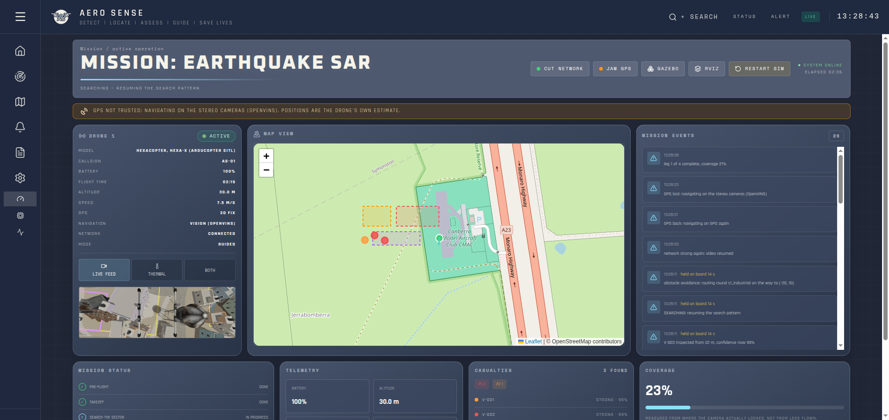
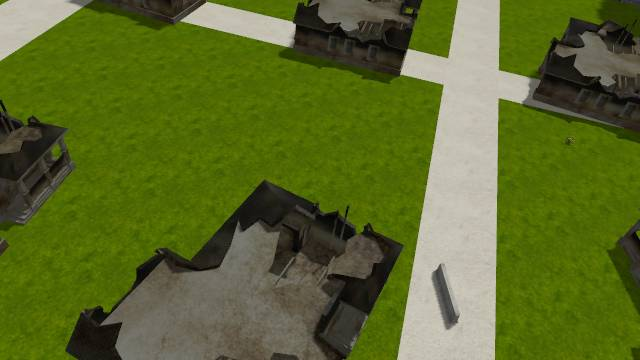

# Verification

What was tested, how, and what came out. Every number here was produced by the code in this
repo; re-run the commands to reproduce them.

## Automated tests

```bash
source /opt/ros/humble/setup.bash && source ~/uav_ws/install/setup.bash
colcon build --base-paths src && source install/setup.bash
PYTEST_DISABLE_PLUGIN_AUTOLOAD=1 python3 -m pytest legacy/prototype/tests src -q    # 182 passed
cd frontend && npx tsc -b && npm run build                           # type-check and build
```

| Test folder | Tests | Covers |
|---|---|---|
| `legacy/prototype/tests` | 32 | the single-process prototype: projection, risk, A*, store-and-forward |
| `src/aero_sense_bridge/test` | 29 | ROS → dashboard JSON, alerts and reports derived only from real data and scoped to their mission, NaN handling, link freshness, spawned-process environment |
| `src/aero_sense_bringup/test` | 20 | world files, model paths, stopping every simulation process |
| `src/aero_sense_description/test` | 17 | the drone model and its sensor payload |
| `src/aero_sense_mission/test` | 22 | search pattern, measured coverage, obstacle detours round tall structures |
| `src/aero_sense_navigation/test` | 8 | LiDAR corridor obstacle detection (library, for a future LiDAR; no simulated one) |
| `src/aero_sense_perception/test` | 28 | thermal detection, geolocation, tracking, triage, structure map (read from the generated buildings) |
| `src/aero_sense_scenario_manager/test` | 22 | the casualty table and its ground truth |
| `src/aero_sense_visualization/test` | 4 | RViz markers |
| **Total** | **182** | all passing |

## Flight tests

Flights before 2026-09-18 flew on SITL's perfect simulated state (`AHRS_EKF_TYPE` 10, see
"GPS-denied navigation"), not on the drone's own sensors. Their search and SWOOP results stand;
their navigation never depended on GPS.

### Local 3D view: OpenVINS's feature points in the map (2026-09-19)

Earthquake mission on the dashboard sim, 3D VIEW open: 1134 feature points reached the bridge
along the flown track (x -197 to 4, y -120 to 26), ground points at z 0.2-0.4 m and roofs up to
7.6 m, beside the structure cylinders and a confirmed casualty. With the voxel map running onboard,
full missions (flown by the RGB retraining session) scored earthquake 14 of 18 and flood 5 of 5,
both with no false positives: no drop in detection.

### Ground teams: who goes to whom (2026-09-19)

Earthquake mission through the mission manager (`tools/mission_evaluation.py earthquake`):
MISSION_COMPLETE in 889 s, 13 of 18 casualties found, no false positives, 0.75 m mean position
error. `ground_routes` routed all 13 by road and split them between the 4 teams with nothing
unassigned (1 h shift, 5 min on site):

| Team | Casualties in order | By road | With time on site |
|---|---|---|---|
| T1 | V-003 P1, V-013 P1, V-012 P2 | 759 m | 19.9 min |
| T2 | V-005 P1, V-006 P1, V-004 P2 | 517 m | 18.6 min |
| T3 | V-009 P1, V-010 P1, V-007 P2, V-008 P3 | 670 m | 23.4 min |
| T4 | V-002 P1, V-001 P2, V-011 P2 | 758 m | 20.1 min |

Every P1 is visited before any P2 on every tour. The priorities are the drone's triage, which got
7 of the 13 wrong against the scenario (the triage section below); the tours follow whatever triage says.

### yolo11n_aerial retrained on focused scenes (2026-09-19)

The RGB model retrained with 150 more rendered scenes weighted to windows, hands and legs under
rubble (`ml/README.md`: 77.1 % to 81.2 % of the scenario's casualties at 0.25). Flown with
`tools/mission_evaluation.py`, fresh headless simulation each, 30 m search.

| Sector | Found | False positives | Time, searched | SWOOP |
|---|---|---|---|---|
| Earthquake, RGB confirmation up to 15 m | 13 of 18 | 0 | 796 s, 98 % | V04 proven; V09's lead ruled out from 16 m |
| Earthquake, up to 20 m | **14 of 18** | 0 | 762 s, 96.5 % | V04 proven from 30 m, **V09 proven from 16 m** |
| Flood, up to 20 m | **5 of 5** | 0 | 446 s, 99.5 % | none needed |

The first earthquake flight lost V09, and not to the model: its lead came up 2 m further west than
before, inside a building's clearance circle, so SWOOP stopped 5.5 m above that building at 16 m,
and RGB could confirm only from 15 m (`rgb.confirm_max_height_m`, now 20: still below the 22 m
inspection and 30 m search heights). Still missed: V13 and V14 inside collapse cracks, V16 and V17
buried, which no camera sees.

### RGB people beside thermal: the deceased casualty found (2026-09-19)

The fine-tuned RGB detector (`ml/models/yolo11n_aerial`, `rgb_detector`) feeding SWOOP leads and,
from the close look, the tracker. `tools/mission_evaluation.py`, fresh headless simulation each,
30 m search, the airframe of ea9e425 (drag, EKF3 source sets).

| Sector | Thermal only | RGB, whole frame | RGB within 35 deg of nadir |
|---|---|---|---|
| Earthquake | 13 of 18 (before ea9e425) | 14 of 18, 0 FP, 978 s, 98 % | **14 of 18**, 0 FP, 722 s, 96 %, 1 SWOOP descent |
| Flood | **5 of 5**, 0 FP, 407 s, 99.5 % | 4 of 5, 0 FP, 559 s, 93 %, 3 descents ruled out | **5 of 5**, 0 FP, 461 s, 99.7 %, 1 ruled out |

The casualty RGB adds is V09, deceased at 295 K and invisible to the thermal camera: an RGB lead
("72 % likely a person at (-108, 39)"), a descent to 10 m, and RGB confirmed them there, triaged P3
as the scenario expects. Still missed: V13 and V14 inside collapse cracks, V16 and V17 buried.

The whole-frame run showed why the cone: over the flood it sent the drone down three times to places
nobody was. The same places photographed straight down gave no detections; seen from the side at the
edge of the 127 deg frame, walls and windows did, and people on terraces 2-5 m up projected onto the
ground plane land metres away. The descents broke up the search (93 %) and it missed V20.

### GPS-denied navigation on OpenVINS (2026-09-18)

Earthquake mission on ArduPilot's EKF3 through all three zones (no network, no GPS, both), the
EKF's position scored against Gazebo's ground truth once a second (`logs/flight_gps_zones6`).

| What | Result |
|---|---|
| Mission | MISSION_COMPLETE, 13 of 18 casualties, 0 false positives, 94% searched |
| GPS jammed | 165 s over 8 passes through the two no-GPS zones; every one switched to OpenVINS and back |
| Flying on OpenVINS | 207 s, error at most 1.28 m (mean 0.65 m), SWOOP descents included |
| Flying on GPS (airborne) | error at most 0.39 m |
| OpenVINS alone | 0.98 m off after 1000 m (rmse 1.06 m), `tools/vio_drift.py` against ground truth |

Found on the way, each flown before it was fixed:
- **SITL's perfect state.** `AHRS_EKF_TYPE` was 10 (the Gazebo plugin's `<no_time_sync>` sets
  that default), so jamming changed nothing and OpenVINS diverging 11 km went unnoticed. Now 3.
- **The drone at the world origin.** Gazebo writes the IMU link's pose only once it moves, so on
  the pad SITL was told the drone stood at the origin facing east; at take-off EKF3 saw a 110 m,
  90 degree jump and failed safe. The drone is now dropped 5 cm onto the pad.
- **OpenVINS started mid-climb.** An EKF3 take-off is too gentle for the jolt its static initialiser
  waits for; it started moving and diverged. It now initialises in a hover after take-off.
- **A diverged OpenVINS is never used:** with GPS jammed and vision not trusted (flown once), the
  EKF failsafe landed the drone instead of following it.

On the dashboard (mission M-20260918-132606): **JAM GPS** switched the drone to OpenVINS within a
second and **RESTORE GPS** back after 5 s of good GPS; the maps draw the zones red, orange and
purple, and the banner and the Navigation row follow what the drone flies on, not the GPS field
(a jammed receiver lets fake 3D fixes through).



### Why OpenVINS was benched: the route planner flew into the mast (2026-09-19)

Replayed against ground truth, the one recorded benching (`logs/flight_nav_none`) was not OpenVINS
failing on its own: it tracked to 0.2-6.5 m for 250 s, then the drone froze in mid-air at
(-34.2, 56.2, 20.8), 0.02 m from the 44 m radio mast's footprint, and OpenVINS diverged after the
knock (5.2 m RMS, then kilometres). After inspecting V-007, 9 m from the mast, the drone hovered
14.6 m from its centre, just inside the 14.7 m clearance circle; `airspace.route` then skipped the
detour's entry corner and flew straight to the far corner, through the mast. The old planner also
doubled back 36 m round overlapping building circles, `safe_goal` pushed goals from one circle into
the next, and a successful mission (`flight_nav_none2`) passed 0.23 m from the industrial hall.

`airspace.route` is now A* on a 2 m grid round all circles at once, straightened with the exact
circles; starts and goals inside circles move to the nearest free point; `NoRoute` when walled in,
and the mission climbs where it is first. Tested on 300 random layouts and the recorded cases.

Earthquake mission (`logs/flight_astar`): MISSION_COMPLETE, 14 of 18, 0 false positives, mean
error 0.83 m, 99.6 % searched, an inspection beside the mast (V-007) flown round it. Closest the
true track came to any structure: 4.9 m from the industrial hall, passing 1.9 m above its roof
(the planner keeps 5 m vertical or 8 m horizontal). OpenVINS fitted ground truth within
0.2-1.0 m RMS throughout; 6 GPS losses, each handed to OpenVINS and back, never benched.

The benching on the dashboard (drawn area, 12 s into the search) was not recorded: the old planner
was then zig-zagging round three overlapping building circles at take-off height, which the new
one flies as walled in, climbing first.

### No GPS and no vision: land in place, never follow a jammer (2026-09-18)

GPS jammed by hand at 3.9 m/s with OpenVINS off (`vio:=false`, `logs/flight_jam_drift`), before and
after, read from the autopilot's own telemetry:

| | Before | After |
|---|---|---|
| EKF source with GPS gone | stayed on set 1 (GPS) | set 3, no position |
| The jammer's fake 3D fixes (up to 3.1 s each) | accepted: "EKF Failsafe Cleared", its estimate ran 1.9 km off at 60 m/s | ignored: "stopped aiding", GPS trusted again only after 5 s |
| What the drone did | chased the false position, landed 93 m away, crash-disarmed | failsafe at 9.5 s, stopped, straight down, normal disarm |
| From loss of GPS to touchdown | 93 m | 42 m, 35 m of it the 9.5 s before the failsafe |

The airframe had no drag, so nothing slowed a drone that stopped holding position; it now has
0.9 N per m/s horizontally (rotor drag, `sensors.yaml`).

Earthquake mission on the dashboard's sim, with the Gazebo window (`logs/flight_nav_none2`):
MISSION_COMPLETE, 14 of 18, 0 false positives, mean error 0.78 m, 98.7 % searched, 4 SWOOP leads
proven, 7 GPS losses each handed to OpenVINS and back. The build included the RGB detector
another session was adding (uncommitted), which likely accounts for the 14th casualty.

Found on the way:
- **The lead finder at pad height.** Its top-hat is sized to a person at the current height: at
  0.3 m one frame took 4.2 s, holding the detector's core through every take-off and landing.
  `suspects.min_height_m` was loaded and never applied; it is now.
- **The tracker crashed after ~1400 looks at one casualty** (`flight_nav_none`): the single-look
  strength was worked back out of the capped confidence by dividing by 0.6 ** (hits - 1), which
  underflows to 0. Each track now keeps its best single look.
- A first attempt at this mission was cut short when the dashboard was started at 23:28:
  `tools/dashboard.sh` restarts a running sim, and the evaluation then followed the new one.

### A search area drawn on the map (2026-09-18)

Drawn on the Live map in the browser (102 x 56 m, x -138 to -36, y 13 to 69), sent as lat/lon and
flown by the mission manager (`logs/flight_drawn_area`): MISSION_COMPLETE, 95 % of the drawn area
searched, 11 casualties reported, and only the 5 inside the rectangle inspected. GPS was lost 4
times and handed to OpenVINS and back each time; OpenVINS fitted GPS within 0.2-0.9 m RMS.

Found on the way, the first try, from the dashboard: the drone inspected casualties it saw on the
way in, outside the area, one at the edge of the north-west no-GPS zone. OpenVINS had been benched
12 s into the search (5.3 m RMS), so with GPS jammed the EKF failsafe's landing drifted 150 m north.
Inspections are now limited to the search area. **Open:** why OpenVINS was benched that early; it
did not recur with the recording on (headless, no Gazebo window).

### Casualty tracker: ByteTrack's BYTE association (2026-09-18)

Earthquake search (`tools/search_evaluation.py`, 30 m), its detections recorded
(`logs/flight_bytetrack`) and replayed through the old nearest-first tracker and BYTE.

| Tracker | Recall (legs 0-5, first flight) | False positives | Duplicates |
|---|---|---|---|
| Nearest-first (before) | 12 of 23 | 0 | 0 |
| BYTE, new track from 0.3 | 12 of 23 | 0 | 0 |
| BYTE, new track from 0.4 up | 11 of 23 (V05 lost: only ever seen at 306 K) | 0 | 0 |
| BYTE, a split body's blobs kept apart beyond 2 m | 12 of 23 | 0 | 2 (blobs 3.2 and 4.3 m apart) |

Thermal confidence comes in three steps (0.31, 0.73, 1.0) and the detector has no false
positives, so on thermal alone BYTE's weak-detection stage has nothing to do: it matches the old
tracker. It is there for the RGB detector's scores.

Found on the way:
- **OpenVINS starved the casualty detector.** It published TF at the IMU's 200 Hz; the
  detector's TF listener spent its core parsing it and saw one thermal frame in 3.5 s. It found
  nobody on the first flight (`logs/flight_bytetrack_tfstarved`). OpenVINS no longer publishes TF.
- **The evaluation flew into the radio mast.** `search_evaluation.py` flew its legs straight, and
  the y 65 leg at 30 m clipped the 44 m mast at (-40, 60). The knock diverged OpenVINS (4 m to
  34 m off in 5 s), the health gate refused it, GPS was then jammed in the north-west zone, and
  the EKF failsafe's landing, which does not brake, drifted 140 m west out of the world. The
  script now goes round what reaches search altitude, as the mission does (`airspace.route`).

The whole search again, round the mast (`logs/flight_bytetrack2`): 13 of the sector's 18
casualties (the other 5 of the 23 are in the flood sector), 0 false positives, mean error 1.4 m;
GPS jammed twice, OpenVINS took over and handed back both times. Replayed, both trackers give 13,
and both kept V01 as two tracks: started more than 6 m apart, their averages later settled 3.2 m
apart. Tracks that settle within 6 m are now folded into the older one; replayed, V01 is one track
and recall is unchanged on both flights.

The earthquake mission with the fold (`logs/flight_fold`): MISSION_COMPLETE, 13 of 18, 13 distinct
names, 0 false positives, mean error 0.87 m, 98 % searched, 6 GPS jams each handed to OpenVINS and
back.

### Real people as casualties (2026-09-17)

The casualties became posed people (`tools/make_people.py`), rubble piles of slabs and brick, and
flood casualties on a car roof, two roof terraces and at two windows. Each sector was flown by the
mission manager (`/aero_sense/mission/start`, SWOOP on), 30 m search altitude, fresh simulation each.

| Sector | Found | Position error | False positives | SWOOP | Missed |
|---|---|---|---|---|---|
| Earthquake | 8 of its 18 (was 14 with the manikin) | 0.95 m | 0 | 3 descents, 1 proven | V06, V15, V18 seated with legs under rubble; V13, V14 in collapse cracks; V21 hand; V22 feet; V16, V17 buried; V09 dead |
| Flood | 3 of its 5 | 0.31 m | 0 | 1 descent, ruled out | V20, V23 leaning out of first-floor windows, under the sunshade |

Why recall fell: the old DARPA manikin was bulky. A real person seen from above is small. Warm area
visible from overhead, from the meshes, with the 256x192 thermal core these flights flew (0.13 m a
pixel from 30 m; the detector then needed 4 pixels):

| Casualty | Visible | Pixels at 30 m | At 22 m |
|---|---|---|---|
| lying in the open (V05, V09, V19) | 0.4-0.5 m2 | 26-31 | 48-58 |
| legs under rubble, lying (V01, V04, V07) | 0.33 m2 | 20 | 38 |
| seated, legs under rubble (V06, V15, V18) | 0.07 m2 | 5 | 9 |
| standing on a car or roof (V10, V12) | 0.1 m2 | 6 | 12 |
| feet only (V22) / hand only (V21) | 0.05 / 0.01 m2 | 3 / 0.6 | 6 / 1.2 |

These are areas, not what the camera renders. gz samples the scene once per pixel, so a limb thinner
than a pixel shows in some frames and not others; that is the likely reason a seated torso of about
5 px was missed (not yet measured frame by frame).

The two standing flood casualties were still found (higher and closer to the camera than the
ground). Both window casualties are hidden from above by the chajja over the window.

### SWOOP's close look counts a hand (2026-09-17)

The detector's smallest blob was a fixed 4 pixels at every height, so SWOOP flew down to a hand, feet
or a seated casualty under rubble, looked straight at a patch of 1-4 px, and ruled it out. It is now
a ground area (`min_blob_m2: 0.008`, about a forearm and hand), turned into pixels for the drone's
height each frame. Flown with `tools/mission_evaluation.py`, 30 m search, 256x192 thermal core:

| Sector | Before (4 px) | After (0.008 m2) | False positives |
|---|---|---|---|
| Earthquake | 8 of 18 | **13 of 18**, 99% searched, 750 s | 0 |
| Flood | 3 of 5 | **5 of 5**, 99.5% searched, 464 s | 0 |

Now found: the hand (V21), the feet (V22), the seated casualties with legs under rubble (V06, V15,
V18) and both people leaning out of windows (V20, V23). Still missed: V09 (dead, at ambient), V16
and V17 (buried; the warm patch on the pile is below 304 K), V13 and V14 (inside collapse cracks).

### Searching lower, 22 m instead of 30 m (2026-09-17)

Flown with `tools/mission_evaluation.py` against the same people, 22 m search with 18 m between legs
(the same overlap as 30 m and 25 m).

| Sector | 30 m | 22 m |
|---|---|---|
| Earthquake | 8 of 18, 95% searched, 730 s | 9 of 18, 90% searched, 771 s |
| Flood | 3 of 5, 100%, 454 s | 3 of 5, 100%, 511 s |

22 m found the seated casualties with their legs under rubble (V06, V15, V18) but missed two it
found from 30 m (V03, V04), covered less and took longer. One casualty is within run-to-run
variation, so the search stays at 30 m.

### OpenVINS on the stereo pair (2026-09-18)

Earthquake mission with `vio:=true`, OpenVINS drift measured against the GPS pose by
`tools/vio_drift.py` (yaw and translation fitted over the first 60 s, error over the rest).

| Run | Flown | Drift at the end | Worst |
|---|---|---|---|
| Before: four live flights, 2026-09-17 | 223–241 m | 13–15 km (diverged) | |
| Replay, diagnostic flight | 223 m | 3.3 m | 5.7 m |
| Replay, earlier flight (diverged every time before) | 253 m | 5.3 m | 6.4 m |
| Live, 170 s measured | 367 m | 2.1 m (0.6 %) | 5.4 m |

The mission itself: MISSION_COMPLETE, 13 of 18 casualties, 0 false positives, 96% searched.

Two causes, both found by replaying recorded bags:
- **The skids.** The down-looking stereo cameras see the landing gear. Over plain ground nearly all
  the corners in view were on it, points that move with the camera while the IMU says the drone
  flies at 6 m/s. Masked now (`tools/vio_mask.py`, `render.airframe_masks`).
- **Initialisation.** The dynamic initialiser started the gyro bias 0.04 rad/s off (the sim's is
  zero). Static init on the pad gets it right, with the threshold at 0.3: a SITL takeoff jerks the
  accelerometer by 0.86 m/s², never the stock 1.5.

Before these fixes the same bag diverged or tracked from run to run (thread timing). After them,
two replays of each bag gave the same result.

### Network outage (2026-09-17)

Mission M-20260917-154227 started from the dashboard bridge, earthquake sector, cruise 8 m/s, with the
bridge reading only the drone's downlink (`comms_link`).

| What | Result |
|---|---|
| Cut by hand on the pad | the ground went silent and showed OFFLINE after 3 s; `pause` was refused ("command not sent"); restore sent 1 held event |
| First outage (SWOOP inside the north-east blocks) | 77 s offline. On reconnect: "sending 3 P2 and 14 held events", each with its original time and `held on board` 14–77 s |
| Legs 3 and 4 through the zone | 16 s offline along leg 4; DEGRADED (video paused) at the edges |
| Mission | carried on unchanged: 14 casualties, 98% searched, MISSION_COMPLETE |

Found on this flight: hovering on the zone boundary flapped the link (outages of 0–5 s), so the
link now returns only 3 m outside a zone (`RECONNECT_MARGIN_M`, tested).

### The Indian society world (2026-09-17)

`tools/search_evaluation.py` flown over each sector of the generated society (seed 23: 96
buildings, winding roads and galis), 30 m altitude, 25 m leg spacing, fresh simulation for each.

| Sector | Found | Position error | False positives | Missed, and why |
|---|---|---|---|---|
| Earthquake (`--x-range -180 -20 --y-range 15 90`) | 13 of its 18 | 0.2 m | 0 | V09 dead at ambient; V16, V17 buried (the warm patch is below the detector's threshold); V21 a hand out of rubble and V22 only feet, too few pixels from 30 m |
| Flood (`--x-range 20 180 --y-range 20 80`) | 3 of its 4 | 0.1 m | 0 | V20, only a waving hand above the water |

The three casualties trapped inside collapses (V13-V15) are found through the crack in the pancaked
slabs, where the old wooden house meshes hid them completely.

### Earlier flights (Iris quadrotor, grid world)

Each flown end to end in Gazebo with ArduPilot SITL, started from the dashboard's API.

| Mission | What it showed | Result |
|---|---|---|
| M-20260911-102001 | the failure that led to obstacle avoidance: search leg 3 ran through the 44 m radio mast | drone hung disarmed on the mast; mission waited 74 min — now caught as EMERGENCY within 3 s |
| M-20260911-115500 | obstacle avoidance: routed round the mast, the industrial hall, the water tower and the fire station | 8 casualties, 92% measured coverage, landed on the pad |
| M-20260911-120231 | the dashboard's restart: simulation torn down and brought back through `POST /api/simulation/restart` | 8 casualties, 90% coverage, landed on the pad |
| M-20260911-151948 | the flight on the website, recorded with `tools/record_replay.py` | 8 casualties found, 91% of the sector searched, 406 s |

## Triage against the scenario

The scenario table (`aero_sense_scenario_manager/config/victims.yaml`) records the priority a
correct triage should reach. Perception never reads it; this compares after the flight.
Agreement on the recorded flight: **3/8**.

| Found as | Scenario | Position error | Triage | Expected | Why the engine decided |
|---|---|---|---|---|---|
| V-001 | V01 | 0.1 m | P2 | P2 | 6 m from a structure |
| V-002 | V02 | 0.2 m | P2 | P1 | 6 m from a structure |
| V-003 | V04 | 0.3 m | P2 | P1 | 6 m from a structure |
| V-004 | V05 | 0.4 m | P3 | P2 | skin +13 K over ambient and falling; 9 m from a structure |
| V-005 | V08 | 0.2 m | P2 | P1 | 2 m from a structure |
| V-006 | V07 | 0.2 m | P2 | P1 | skin +13 K over ambient and falling; 5 m from a structure |
| V-007 | V06 | 0.2 m | P2 | P2 | 0 m from a structure |
| V-008 | V03 | 0.3 m | P2 | P2 | 2 m from a structure |

The ordering is right: the casualty in open ground ranks below those against buildings. Where it
disagrees, it under-ranks: casualties the scenario marks P1 because they are pinned or waving come
out P2, because from 30 m the drone cannot see that someone is trapped or moving. Every casualty
is still found and located to within half a metre; the ranking is decision support for the
ground team, not a diagnosis.

Not found in the earthquake sector: V09 (no useful thermal contrast; only RGB shape betrays this one); V13 (inside the second terrace, under the collapsed roof); V14 (inside the market-block house, visible only where the roof has gone); V15 (sheltering inside the north terrace, conscious). Casualties fully inside intact
buildings are invisible to a downward thermal camera, and a deceased casualty at ambient
temperature has no thermal contrast.

## Screenshots

The website, playing back the recorded flight:

| | |
|---|---|
|  |  |
| Live dashboard 3:20 into the flight: six casualties, 50% measured coverage | Live map: both sectors on satellite imagery, the drone and the triaged casualties |
|  |  |
| Alert center, raised only by real detections | Printable A4 mission report |
|  | |
| Mission command: the two sectors | |

The drone's own cameras during the recorded flight:

| RGB | Thermal (LWIR) |
|---|---|
|  |  |
| 39 s: first casualty in the lane between collapsed terraces | the same moment in thermal |
|  |  |
| 250 s: over the north-east block | 158 s: a warm body beside the radio mast the route goes round |
