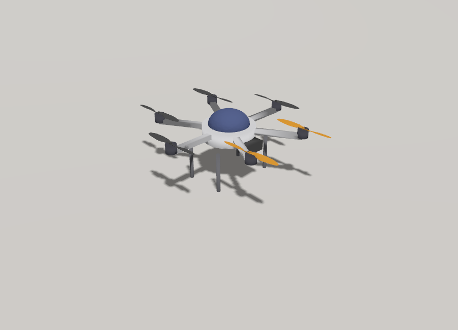

# Concept hexacopter

The first Aero Sense hexacopter look, kept as a model: white hub with a blue dome, six arms, orange
front props (heading at a glance), four legs and the payload box. It is the simulated drone as of
commit `e4f993a`, before the team's frame replaced it.

| File | Use |
|---|---|
| `aero_sense_hexacopter_concept.glb` | coloured, for Blender, web viewers, Gazebo, slides |
| `aero_sense_hexacopter_concept.stl` | one uncoloured mesh, for CAD import or 3-D printing |
| `export_concept.py` | rebuilds both from that commit |

Metres, X forward, Y left, Z up; 0.79 × 0.64 × 0.29 m. The propeller shapes come from ArduPilot's
`ardupilot_gazebo` iris model and keep that project's license. It is a look, not a buildable frame:
arms, hub and legs are simple shapes with no fixings.
